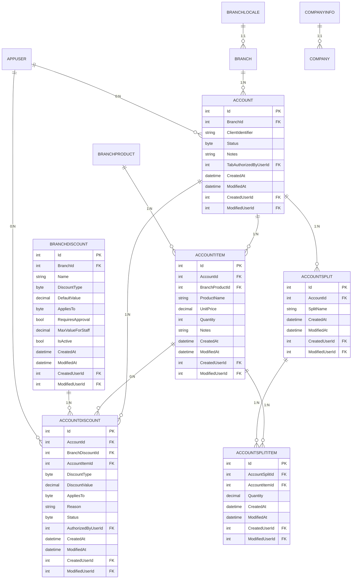
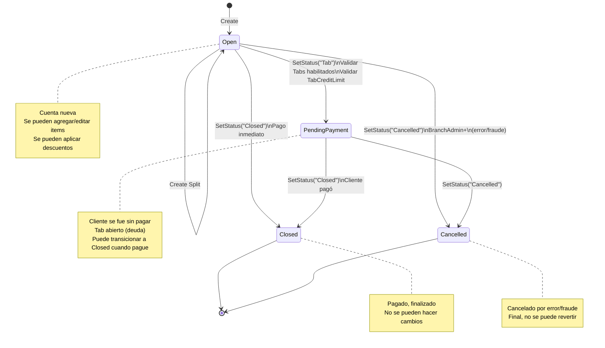
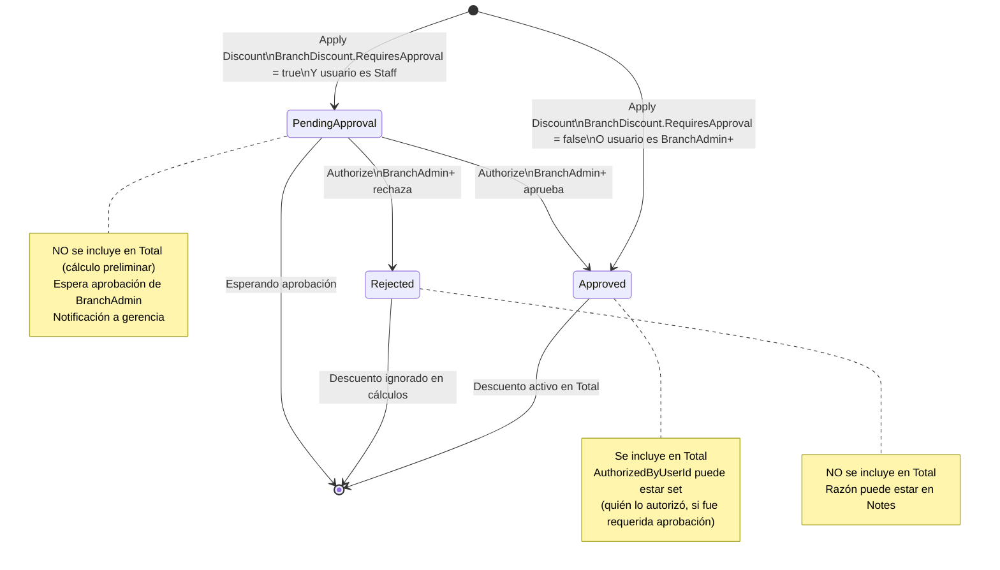

# Especificación Técnica: Módulo de Gestión de Cuentas

**Versión:** 1.0
**Última actualización:** 23 de marzo de 2026
**Stack:** .NET 10, EF Core 9, SQL Server 2019+
**Módulo:** Account Management (DigiMenuAPI)

---

## 1. Diagrama de Relaciones de Entidades (ERD)



---

## 2. Esquema de Base de Datos

### 2.1 Tabla: Accounts

Contiene cabecera de cada cuenta (bill).

```sql
CREATE TABLE Accounts (
    Id INT PRIMARY KEY IDENTITY(1,1),
    BranchId INT NOT NULL,
    ClientIdentifier NVARCHAR(200) NOT NULL,
    Status TINYINT NOT NULL DEFAULT 1,  -- AccountStatus enum
    Notes NVARCHAR(500) NULL,
    TabAuthorizedByUserId INT NULL,
    CreatedAt DATETIME2 NOT NULL DEFAULT GETUTCDATE(),
    ModifiedAt DATETIME2 NULL,
    CreatedUserId INT NULL,
    ModifiedUserId INT NULL,

    -- Constraints
    CONSTRAINT PK_Accounts PRIMARY KEY (Id),
    CONSTRAINT FK_Accounts_Branches_BranchId FOREIGN KEY (BranchId)
        REFERENCES Branches(Id) ON DELETE RESTRICT,
    CONSTRAINT FK_Accounts_Users_TabAuthorizedByUserId FOREIGN KEY (TabAuthorizedByUserId)
        REFERENCES Users(Id) ON DELETE RESTRICT,
    CONSTRAINT CK_Accounts_Status CHECK (Status IN (1, 2, 3, 4))
);

CREATE NONCLUSTERED INDEX IX_Accounts_BranchId ON Accounts(BranchId);
CREATE NONCLUSTERED INDEX IX_Accounts_Status ON Accounts(Status);
CREATE NONCLUSTERED INDEX IX_Accounts_CreatedAt ON Accounts(CreatedAt);
```

**Columnas:**

| Columna | Tipo | Nullable | Default | Descripción |
|---------|------|----------|---------|-------------|
| Id | INT | No | Identity | Clave primaria |
| BranchId | INT | No | — | Sucursal dueña de la cuenta |
| ClientIdentifier | NVARCHAR(200) | No | — | Identificación del cliente (texto libre: mesa, nombre, etc) |
| Status | TINYINT | No | 1 | Estado: Open=1, PendingPayment=2, Closed=3, Cancelled=4 |
| Notes | NVARCHAR(500) | Sí | NULL | Notas adicionales |
| TabAuthorizedByUserId | INT | Sí | NULL | Usuario que autorizó la marcación como Tab |
| CreatedAt | DATETIME2 | No | GETUTCDATE() | Timestamp de creación |
| ModifiedAt | DATETIME2 | Sí | NULL | Timestamp última modificación |
| CreatedUserId | INT | Sí | NULL | Usuario que creó |
| ModifiedUserId | INT | Sí | NULL | Usuario que modificó |

---

### 2.2 Tabla: AccountItems

Líneas de la cuenta (artículos ordenados).

```sql
CREATE TABLE AccountItems (
    Id INT PRIMARY KEY IDENTITY(1,1),
    AccountId INT NOT NULL,
    BranchProductId INT NOT NULL,
    ProductName NVARCHAR(200) NOT NULL,
    UnitPrice DECIMAL(18,2) NOT NULL,
    Quantity INT NOT NULL DEFAULT 1,
    Notes NVARCHAR(300) NULL,
    CreatedAt DATETIME2 NOT NULL DEFAULT GETUTCDATE(),
    ModifiedAt DATETIME2 NULL,
    CreatedUserId INT NULL,
    ModifiedUserId INT NULL,

    -- Constraints
    CONSTRAINT PK_AccountItems PRIMARY KEY (Id),
    CONSTRAINT FK_AccountItems_Accounts_AccountId FOREIGN KEY (AccountId)
        REFERENCES Accounts(Id) ON DELETE CASCADE,
    CONSTRAINT FK_AccountItems_BranchProducts_BranchProductId FOREIGN KEY (BranchProductId)
        REFERENCES BranchProducts(Id) ON DELETE RESTRICT,
    CONSTRAINT CK_AccountItems_Quantity CHECK (Quantity > 0)
);

CREATE NONCLUSTERED INDEX IX_AccountItems_AccountId ON AccountItems(AccountId);
CREATE NONCLUSTERED INDEX IX_AccountItems_BranchProductId ON AccountItems(BranchProductId);
```

**Columnas:**

| Columna | Tipo | Nullable | Default | Descripción |
|---------|------|----------|---------|-------------|
| Id | INT | No | Identity | Clave primaria |
| AccountId | INT | No | — | Referencia a Accounts (CASCADE) |
| BranchProductId | INT | No | — | Referencia a BranchProduct (RESTRICT) |
| ProductName | NVARCHAR(200) | No | — | SNAPSHOT del nombre del producto al momento |
| UnitPrice | DECIMAL(18,2) | No | — | SNAPSHOT del precio (OfferPrice ?? Price) |
| Quantity | INT | No | 1 | Cantidad (entero: 1, 2, 3...) |
| Notes | NVARCHAR(300) | Sí | NULL | Notas del cliente (sin picante, etc) |
| CreatedAt | DATETIME2 | No | GETUTCDATE() | Timestamp |
| ModifiedAt | DATETIME2 | Sí | NULL | Timestamp |
| CreatedUserId | INT | Sí | NULL | Usuario |
| ModifiedUserId | INT | Sí | NULL | Usuario |

---

### 2.3 Tabla: AccountDiscounts

Descuentos aplicados a una cuenta o artículo específico.

```sql
CREATE TABLE AccountDiscounts (
    Id INT PRIMARY KEY IDENTITY(1,1),
    AccountId INT NOT NULL,
    BranchDiscountId INT NOT NULL,
    AccountItemId INT NULL,  -- NULL = aplica a toda cuenta
    DiscountType TINYINT NOT NULL,  -- DiscountType enum
    DiscountValue DECIMAL(18,2) NOT NULL,
    AppliesTo TINYINT NOT NULL,  -- DiscountAppliesTo enum
    Reason NVARCHAR(300) NOT NULL,
    Status TINYINT NOT NULL DEFAULT 1,  -- AccountDiscountStatus enum
    AuthorizedByUserId INT NULL,
    CreatedAt DATETIME2 NOT NULL DEFAULT GETUTCDATE(),
    ModifiedAt DATETIME2 NULL,
    CreatedUserId INT NULL,
    ModifiedUserId INT NULL,

    -- Constraints
    CONSTRAINT PK_AccountDiscounts PRIMARY KEY (Id),
    CONSTRAINT FK_AccountDiscounts_Accounts_AccountId FOREIGN KEY (AccountId)
        REFERENCES Accounts(Id) ON DELETE CASCADE,
    CONSTRAINT FK_AccountDiscounts_BranchDiscounts_BranchDiscountId FOREIGN KEY (BranchDiscountId)
        REFERENCES BranchDiscounts(Id) ON DELETE RESTRICT,
    CONSTRAINT FK_AccountDiscounts_AccountItems_AccountItemId FOREIGN KEY (AccountItemId)
        REFERENCES AccountItems(Id) ON DELETE RESTRICT,
    CONSTRAINT FK_AccountDiscounts_Users_AuthorizedByUserId FOREIGN KEY (AuthorizedByUserId)
        REFERENCES Users(Id) ON DELETE RESTRICT,
    CONSTRAINT CK_AccountDiscounts_DiscountValue CHECK (DiscountValue > 0),
    CONSTRAINT CK_AccountDiscounts_Status CHECK (Status IN (1, 2, 3))
);

CREATE NONCLUSTERED INDEX IX_AccountDiscounts_AccountId ON AccountDiscounts(AccountId);
CREATE NONCLUSTERED INDEX IX_AccountDiscounts_Status ON AccountDiscounts(Status);
CREATE NONCLUSTERED INDEX IX_AccountDiscounts_AccountItemId ON AccountDiscounts(AccountItemId);
```

**Columnas:**

| Columna | Tipo | Nullable | Default | Descripción |
|---------|------|----------|---------|-------------|
| Id | INT | No | Identity | Clave primaria |
| AccountId | INT | No | — | Referencia a Accounts (CASCADE) |
| BranchDiscountId | INT | No | — | Referencia a BranchDiscount plantilla (RESTRICT) |
| AccountItemId | INT | Sí | NULL | Si null: descuento a toda cuenta. Si setted: descuento a artículo |
| DiscountType | TINYINT | No | — | Tipo: Percentage=1, FixedAmount=2 |
| DiscountValue | DECIMAL(18,2) | No | — | Valor: 10 (si %) o 5 (si fijo) |
| AppliesTo | TINYINT | No | — | Aplica a: WholeAccount=1, SpecificItem=2, Both=3 |
| Reason | NVARCHAR(300) | No | — | Motivo de descuento (requerido, auditoría) |
| Status | TINYINT | No | 1 | Approved=1, PendingApproval=2, Rejected=3 |
| AuthorizedByUserId | INT | Sí | NULL | Usuario que aprobó (si fue requerida aprobación) |
| CreatedAt | DATETIME2 | No | GETUTCDATE() | Timestamp |
| ModifiedAt | DATETIME2 | Sí | NULL | Timestamp |
| CreatedUserId | INT | Sí | NULL | Usuario |
| ModifiedUserId | INT | Sí | NULL | Usuario |

---

### 2.4 Tabla: BranchDiscounts

Plantillas de descuentos predefinidos por sucursal/empresa.

```sql
CREATE TABLE BranchDiscounts (
    Id INT PRIMARY KEY IDENTITY(1,1),
    BranchId INT NOT NULL,
    Name NVARCHAR(100) NOT NULL,
    DiscountType TINYINT NOT NULL,  -- DiscountType enum
    DefaultValue DECIMAL(18,2) NOT NULL,
    AppliesTo TINYINT NOT NULL,  -- DiscountAppliesTo enum
    RequiresApproval BIT NOT NULL DEFAULT 0,
    MaxValueForStaff DECIMAL(18,2) NULL,
    IsActive BIT NOT NULL DEFAULT 1,
    CreatedAt DATETIME2 NOT NULL DEFAULT GETUTCDATE(),
    ModifiedAt DATETIME2 NULL,
    CreatedUserId INT NULL,
    ModifiedUserId INT NULL,

    -- Constraints
    CONSTRAINT PK_BranchDiscounts PRIMARY KEY (Id),
    CONSTRAINT FK_BranchDiscounts_Branches_BranchId FOREIGN KEY (BranchId)
        REFERENCES Branches(Id) ON DELETE RESTRICT,
    CONSTRAINT CK_BranchDiscounts_DefaultValue CHECK (DefaultValue > 0),
    CONSTRAINT CK_BranchDiscounts_MaxValueForStaff CHECK (MaxValueForStaff IS NULL OR MaxValueForStaff > 0)
);

CREATE NONCLUSTERED INDEX IX_BranchDiscounts_BranchId ON BranchDiscounts(BranchId);
CREATE NONCLUSTERED INDEX IX_BranchDiscounts_IsActive ON BranchDiscounts(IsActive);
```

**Columnas:**

| Columna | Tipo | Nullable | Default | Descripción |
|---------|------|----------|---------|-------------|
| Id | INT | No | Identity | Clave primaria |
| BranchId | INT | No | — | Sucursal (referencia) |
| Name | NVARCHAR(100) | No | — | Nombre: "Happy Hour", "VIP", etc |
| DiscountType | TINYINT | No | — | Percentage=1 o FixedAmount=2 |
| DefaultValue | DECIMAL(18,2) | No | — | Valor por defecto (10 o 5) |
| AppliesTo | TINYINT | No | — | WholeAccount=1, SpecificItem=2, Both=3 |
| RequiresApproval | BIT | No | 0 | ¿Requiere aprobación para aplicar? |
| MaxValueForStaff | DECIMAL(18,2) | Sí | NULL | Límite máximo para Staff (ej: max 15% si descuento es 20%) |
| IsActive | BIT | No | 1 | ¿Está disponible? |
| CreatedAt | DATETIME2 | No | GETUTCDATE() | Timestamp |
| ModifiedAt | DATETIME2 | Sí | NULL | Timestamp |
| CreatedUserId | INT | Sí | NULL | Usuario |
| ModifiedUserId | INT | Sí | NULL | Usuario |

---

### 2.5 Tabla: AccountSplits

Agrupaciones de artículos por persona en una división de cuenta.

```sql
CREATE TABLE AccountSplits (
    Id INT PRIMARY KEY IDENTITY(1,1),
    AccountId INT NOT NULL,
    SplitName NVARCHAR(100) NOT NULL,
    CreatedAt DATETIME2 NOT NULL DEFAULT GETUTCDATE(),
    ModifiedAt DATETIME2 NULL,
    CreatedUserId INT NULL,
    ModifiedUserId INT NULL,

    -- Constraints
    CONSTRAINT PK_AccountSplits PRIMARY KEY (Id),
    CONSTRAINT FK_AccountSplits_Accounts_AccountId FOREIGN KEY (AccountId)
        REFERENCES Accounts(Id) ON DELETE CASCADE
);

CREATE NONCLUSTERED INDEX IX_AccountSplits_AccountId ON AccountSplits(AccountId);
```

**Columnas:**

| Columna | Tipo | Nullable | Default | Descripción |
|---------|------|----------|---------|-------------|
| Id | INT | No | Identity | Clave primaria |
| AccountId | INT | No | — | Referencia a Accounts (CASCADE) |
| SplitName | NVARCHAR(100) | No | — | Nombre del grupo: "Juan", "Mesa A", etc |
| CreatedAt | DATETIME2 | No | GETUTCDATE() | Timestamp |
| ModifiedAt | DATETIME2 | Sí | NULL | Timestamp |
| CreatedUserId | INT | Sí | NULL | Usuario |
| ModifiedUserId | INT | Sí | NULL | Usuario |

---

### 2.6 Tabla: AccountSplitItems

Mapeo de cantidades de artículos a splits (divisiones).

```sql
CREATE TABLE AccountSplitItems (
    Id INT PRIMARY KEY IDENTITY(1,1),
    AccountSplitId INT NOT NULL,
    AccountItemId INT NOT NULL,
    Quantity DECIMAL(18,3) NOT NULL,
    CreatedAt DATETIME2 NOT NULL DEFAULT GETUTCDATE(),
    ModifiedAt DATETIME2 NULL,
    CreatedUserId INT NULL,
    ModifiedUserId INT NULL,

    -- Constraints
    CONSTRAINT PK_AccountSplitItems PRIMARY KEY (Id),
    CONSTRAINT FK_AccountSplitItems_AccountSplits_AccountSplitId FOREIGN KEY (AccountSplitId)
        REFERENCES AccountSplits(Id) ON DELETE CASCADE,
    CONSTRAINT FK_AccountSplitItems_AccountItems_AccountItemId FOREIGN KEY (AccountItemId)
        REFERENCES AccountItems(Id) ON DELETE RESTRICT,
    CONSTRAINT CK_AccountSplitItems_Quantity CHECK (Quantity > 0)
);

CREATE NONCLUSTERED INDEX IX_AccountSplitItems_AccountSplitId ON AccountSplitItems(AccountSplitId);
CREATE NONCLUSTERED INDEX IX_AccountSplitItems_AccountItemId ON AccountSplitItems(AccountItemId);
```

**Columnas:**

| Columna | Tipo | Nullable | Default | Descripción |
|---------|------|----------|---------|-------------|
| Id | INT | No | Identity | Clave primaria |
| AccountSplitId | INT | No | — | Referencia a AccountSplit (CASCADE) |
| AccountItemId | INT | No | — | Referencia a AccountItem (RESTRICT) |
| Quantity | DECIMAL(18,3) | No | — | Cantidad (permite fracciones: 0.5, 1.5) |
| CreatedAt | DATETIME2 | No | GETUTCDATE() | Timestamp |
| ModifiedAt | DATETIME2 | Sí | NULL | Timestamp |
| CreatedUserId | INT | Sí | NULL | Usuario |
| ModifiedUserId | INT | Sí | NULL | Usuario |

---

### 2.7 Tablas Modificadas

#### BranchLocales

```sql
ALTER TABLE BranchLocales ADD
    TabsEnabled BIT NOT NULL DEFAULT 0,
    TabCreditLimit DECIMAL(18,2) NULL;

-- Index para búsquedas rápidas de sucursales con Tabs habilitados
CREATE NONCLUSTERED INDEX IX_BranchLocales_TabsEnabled
    ON BranchLocales(TabsEnabled) WHERE TabsEnabled = 1;
```

**Columnas Nuevas:**

| Columna | Tipo | Nullable | Default | Descripción |
|---------|------|----------|---------|-------------|
| TabsEnabled | BIT | No | 0 | ¿Esta sucursal permite Tabs? |
| TabCreditLimit | DECIMAL(18,2) | Sí | NULL | Límite máximo de crédito en tabs (null = sin límite) |

#### CompanyInfos

```sql
ALTER TABLE CompanyInfos ADD
    TabsEnabled BIT NOT NULL DEFAULT 0;
```

**Columnas Nuevas:**

| Columna | Tipo | Nullable | Default | Descripción |
|---------|------|----------|---------|-------------|
| TabsEnabled | BIT | No | 0 | ¿Esta empresa permite Tabs en general? |

---

## 3. Migración EF Core

### Nombre
`AddAccountManagement` (timestamp: 20260323031758)

### Resumen
- Crea 6 tablas nuevas: Accounts, AccountItems, AccountDiscounts, BranchDiscounts, AccountSplits, AccountSplitItems
- Modifica 2 tablas: BranchLocales, CompanyInfos
- Crea índices para optimizar búsquedas frecuentes

### Aplicar
```bash
dotnet ef database update AddAccountManagement
```

### Rollback
```bash
dotnet ef database update [PreviousMigration]
```

### Notas
- Sin datos iniciales (seeding), solo estructura
- Todos los FK con RESTRICT excepto account → items (CASCADE) y splits (CASCADE)
- Auditoría completa (CreatedAt, ModifiedAt, CreatedUserId, ModifiedUserId)

---

## 4. Referencia de API Completa

### 4.1 Cuentas (Accounts)

| Método | Ruta | Auth | Descripción |
|--------|------|------|-------------|
| GET | `/api/accounts/{branchId}` | Requerida | Listar cuentas de sucursal (paginado) |
| GET | `/api/accounts/detail/{id}` | Requerida | Obtener detalle completo de una cuenta |
| POST | `/api/accounts` | Requerida | Crear nueva cuenta |
| POST | `/api/accounts/{id}/items` | Requerida | Agregar artículo a cuenta |
| PUT | `/api/accounts/items/{itemId}` | Requerida | Actualizar artículo (cantidad, notas) |
| DELETE | `/api/accounts/items/{itemId}` | Requerida | Eliminar artículo de cuenta |
| POST | `/api/accounts/{id}/discounts` | Requerida | Aplicar descuento |
| PATCH | `/api/accounts/discounts/{discountId}/authorize` | Requerida | Autorizar/rechazar descuento pendiente |
| DELETE | `/api/accounts/discounts/{discountId}` | Requerida | Eliminar descuento |
| PATCH | `/api/accounts/{id}/status` | Requerida | Cambiar status (Open → PendingPayment, Closed, Cancelled) |
| POST | `/api/accounts/{id}/splits` | Requerida | Crear división de cuenta |
| DELETE | `/api/accounts/splits/{splitId}` | Requerida | Eliminar división |

### 4.2 Descuentos Predefinidos (BranchDiscounts)

| Método | Ruta | Auth | Descripción |
|--------|------|------|-------------|
| GET | `/api/branch-discounts/{branchId}` | Requerida | Listar descuentos de sucursal |
| GET | `/api/branch-discounts/item/{id}` | Requerida | Obtener descuento por ID |
| POST | `/api/branch-discounts` | Requerida | Crear descuento nuevo |
| PUT | `/api/branch-discounts/{id}` | Requerida | Actualizar descuento |
| PATCH | `/api/branch-discounts/{id}/toggle` | Requerida | Habilitar/deshabilitar |
| DELETE | `/api/branch-discounts/{id}` | Requerida | Eliminar descuento |

### 4.3 Configuración (Settings)

| Método | Ruta | Auth | Descripción |
|--------|------|------|-------------|
| PATCH | `/api/settings/company/tabs` | Requerida | Habilitar/deshabilitar Tabs a nivel empresa |
| PATCH | `/api/settings/branch/{branchId}/tabs` | Requerida | Configurar Tabs de sucursal (habilitar, límite) |

---

### 4.4 Detalle de Endpoints

#### GET /api/accounts/{branchId}

**Query Parameters:**
```
status: AccountStatus? (null, 1, 2, 3, 4)
page: int (default 1)
pageSize: int (default 20)
```

**Response (200 OK):**
```json
{
  "success": true,
  "data": {
    "items": [
      {
        "id": 1,
        "branchId": 5,
        "clientIdentifier": "Mesa 3",
        "status": 1,
        "statusLabel": "Abierta",
        "notes": null,
        "createdAt": "2026-03-23T15:30:00Z",
        "itemCount": 3,
        "subtotal": 53.00,
        "totalDiscounts": 5.00,
        "total": 48.00
      }
    ],
    "totalCount": 150,
    "page": 1,
    "pageSize": 20,
    "totalPages": 8
  }
}
```

---

#### GET /api/accounts/detail/{id}

**Response (200 OK):**
```json
{
  "success": true,
  "data": {
    "id": 1,
    "branchId": 5,
    "clientIdentifier": "Mesa 3",
    "status": 1,
    "statusLabel": "Abierta",
    "notes": "Cliente habitual",
    "tabAuthorizedByUserId": null,
    "createdAt": "2026-03-23T15:30:00Z",
    "items": [
      {
        "id": 10,
        "productName": "Pasta Carbonara",
        "unitPrice": 12.00,
        "quantity": 2,
        "notes": null,
        "createdAt": "2026-03-23T15:31:00Z"
      }
    ],
    "discounts": [
      {
        "id": 20,
        "branchDiscountId": 3,
        "branchDiscountName": "Happy Hour",
        "accountItemId": null,
        "discountType": 1,
        "discountValue": 10,
        "appliesto": 1,
        "reason": "Promo vigente",
        "status": 1,
        "statusLabel": "Aprobado",
        "authorizedByUserId": null,
        "authorizedAt": null,
        "createdAt": "2026-03-23T15:32:00Z"
      }
    ],
    "splits": [
      {
        "id": 100,
        "splitName": "Juan",
        "items": [
          {
            "accountItemId": 10,
            "productName": "Pasta Carbonara",
            "quantity": 1.0
          }
        ],
        "subtotal": 10.00,
        "discountApplied": 1.00,
        "total": 9.00
      }
    ],
    "subtotal": 53.00,
    "totalDiscounts": 5.00,
    "total": 48.00
  }
}
```

---

#### POST /api/accounts

**Request Body:**
```json
{
  "branchId": 5,
  "clientIdentifier": "Mesa 3",
  "notes": "Cliente VIP"
}
```

**Response (201 Created):**
```json
{
  "success": true,
  "message": "Cuenta creada correctamente.",
  "data": {
    "id": 1,
    "branchId": 5,
    "clientIdentifier": "Mesa 3",
    "status": 1,
    "statusLabel": "Abierta",
    "createdAt": "2026-03-23T15:30:00Z",
    ...
  }
}
```

---

#### POST /api/accounts/{id}/items

**Request Body:**
```json
{
  "accountId": 1,
  "branchProductId": 25,
  "quantity": 2,
  "notes": "Sin picante"
}
```

**Response (200 OK):**
- Retorna AccountDetailReadDto completo

---

#### POST /api/accounts/{id}/discounts

**Request Body:**
```json
{
  "accountId": 1,
  "branchDiscountId": 3,
  "accountItemId": null,
  "discountValue": 10,
  "reason": "Cliente habitual"
}
```

**Lógica:**
1. Valida permiso del usuario (Staff solo si no requiere aprobación)
2. Si BranchDiscount.RequiresApproval=true → Status=PendingApproval
3. Sino → Status=Approved
4. Retorna cuenta actualizada

**Response (200 OK):**
- Retorna AccountDetailReadDto completo

---

#### PATCH /api/accounts/discounts/{discountId}/authorize

**Request Body:**
```json
{
  "accountDiscountId": 20,
  "approved": true,
  "notes": "OK, dentro de límites"
}
```

**Lógica:**
1. Valida que usuario sea BranchAdmin+ (Staff rechazado)
2. Si approved=true → Status=Approved, AuthorizedByUserId=userID
3. Si approved=false → Status=Rejected
4. Retorna cuenta completa

**Response (200 OK):**
- Retorna AccountDetailReadDto completo

---

#### PATCH /api/accounts/{id}/status

**Request Body:**
```json
{
  "accountId": 1,
  "newStatus": 2,
  "notes": "Tab abierto"
}
```

**Lógica:**
1. Valida transición válida de estado
2. Si newStatus=PendingPayment (2):
   - Verifica TabsEnabled en Empresa y Sucursal
   - Valida TabCreditLimit si está set
   - Si excede → rechaza con error claro
3. Si newStatus=Cancelled (4):
   - Solo BranchAdmin+ permitido
4. Actualiza ModifiedAt, ModifiedUserId

**Response (200 OK):**
- Retorna AccountDetailReadDto completo

---

#### POST /api/branch-discounts

**Request Body:**
```json
{
  "branchId": 5,
  "name": "Happy Hour",
  "discountType": 1,
  "defaultValue": 10.0,
  "appliesTo": 1,
  "requiresApproval": false,
  "maxValueForStaff": null,
  "isActive": true
}
```

**Validaciones:**
- CompanyAdmin+ permitido
- Name único por sucursal
- DefaultValue > 0
- MaxValueForStaff debe ser <= DefaultValue (si ambos están set)

**Response (201 Created):**
```json
{
  "success": true,
  "data": {
    "id": 3,
    "branchId": 5,
    "name": "Happy Hour",
    ...
  }
}
```

---

## 5. Reglas de Negocio (Nivel de Servicio)

### 5.1 Snapshot de Precio

**Cuándo ocurre:**
Cuando se agrega un AccountItem a una Account.

**Lógica:**
```csharp
var branchProduct = await _context.BranchProducts
    .Include(bp => bp.Product)
    .FirstOrDefaultAsync(bp => bp.Id == dto.BranchProductId);

var unitPrice = branchProduct.OfferPrice ?? branchProduct.Product.Price;

var accountItem = new AccountItem
{
    ProductName = branchProduct.Product.Name,
    UnitPrice = unitPrice,
    Quantity = dto.Quantity
};
```

**Auditoría:**
- CreatedAt = ahora
- CreatedUserId = usuario actual
- Si se edita después (PUT), ModifiedAt y ModifiedUserId se actualizan

---

### 5.2 Cálculo de Total (Server-Side)

**Dónde se calcula:**
Cada vez que se retorna AccountDetailReadDto (lectura completa).

**Algoritmo (pseudocódigo):**
```
Subtotal = 0
for each AccountItem {
    Subtotal += Item.Quantity * Item.UnitPrice
}

ItemLevelDiscounts = 0
for each AccountDiscount where Status = Approved && AccountItemId is NOT NULL {
    if DiscountType = Percentage {
        discount = (ItemSubtotal * DiscountValue) / 100
    } else {
        discount = DiscountValue
    }
    ItemLevelDiscounts += discount
}

AfterItemDiscounts = Subtotal - ItemLevelDiscounts

AccountLevelDiscounts = 0
for each AccountDiscount where Status = Approved && AccountItemId is NULL {
    if DiscountType = Percentage {
        discount = (AfterItemDiscounts * DiscountValue) / 100
    } else {
        discount = DiscountValue
    }
    AccountLevelDiscounts += discount
}

Total = MAX(0, AfterItemDiscounts - AccountLevelDiscounts)
```

**Notas:**
- Discounts rechazados (Status=Rejected) NO se incluyen
- Discounts pendientes (Status=PendingApproval) NO se incluyen
- El Total jamás puede ser < 0 (MAX con 0)

---

### 5.3 Máquina de Estados: Cuenta



---

### 5.4 Máquina de Estados: Descuento de Cuenta



---

### 5.5 Validación de Tab (Crédito)

**Cuándo se valida:**
Cuando se intenta SetStatus a PendingPayment (marcar como Tab).

**Pasos:**
1. Verificar CompanyInfo.TabsEnabled = true
   - Si false → Error: "Los Tabs están deshabilitados en la empresa"
2. Verificar BranchLocale.TabsEnabled = true (para esa sucursal)
   - Si false → Error: "Los Tabs no están habilitados en esta sucursal"
3. Si BranchLocale.TabCreditLimit está set:
   - Sumar todos los Accounts con Status=PendingPayment de esa sucursal
   - totalOpenTabs = SUM(Total) donde Status=PendingPayment
   - newTotal = totalOpenTabs + account.Total
   - Si newTotal > TabCreditLimit → Error: "Límite de crédito alcanzado. Límite: $500, Actual: $480, Solicitado: $50"

---

### 5.6 Validación de Split

**Cuándo:**
Cuando se crea AccountSplitItem o se actualiza cantidad.

**Validación (propuesta, lado backend):**
```
for each AccountItem {
    totalSplitQuantity = SUM(AccountSplitItem.Quantity where AccountItemId = this)
    if totalSplitQuantity != AccountItem.Quantity {
        Warn: "Cantidad de splits no cuadra. Item: 2, Splits: 1.5"
        // Optionally enforce o solo advertir
    }
}
```

**Nota:** Esta validación puede ser flexible (advertencia) o estricta (error). La versión actual probablemente es advertencia.

---

## 6. Arquitectura Frontend (Angular 19)

### Estructura de Carpetas (Propuesta)

```
src/app/features/admin/
├── account-management/
│   ├── account-list/
│   │   ├── account-list.component.ts
│   │   ├── account-list.component.html
│   │   └── account-list.component.scss
│   ├── account-detail/
│   │   ├── account-detail.component.ts
│   │   ├── account-detail.component.html
│   │   └── account-detail.component.scss
│   ├── account-form/
│   │   ├── account-form.component.ts
│   │   └── account-form.component.html
│   ├── discount-approval/
│   │   ├── discount-approval.component.ts
│   │   └── discount-approval.component.html
│   └── discount-management/
│       ├── discount-list.component.ts
│       ├── discount-form.component.ts
│       └── ...

src/app/core/services/
├── account.service.ts
├── branch-discount.service.ts
└── account-settings.service.ts

src/app/shared/components/
├── account-summary/
├── discount-card/
├── split-editor/
└── tab-configuration/
```

### Servicios Principales (TypeScript)

**account.service.ts**
```typescript
export class AccountService {
  getByBranch(branchId: number, status?: AccountStatus, page = 1, pageSize = 20)
    → Observable<PagedResult<AccountReadDto>>

  getById(id: number)
    → Observable<AccountDetailReadDto>

  create(dto: AccountCreateDto)
    → Observable<AccountDetailReadDto>

  addItem(id: number, item: AccountItemCreateDto)
    → Observable<AccountDetailReadDto>

  updateItem(itemId: number, item: AccountItemUpdateDto)
    → Observable<AccountDetailReadDto>

  removeItem(itemId: number)
    → Observable<void>

  applyDiscount(discount: ApplyDiscountDto)
    → Observable<AccountDetailReadDto>

  authorizeDiscount(auth: AuthorizeDiscountDto)
    → Observable<AccountDetailReadDto>

  removeDiscount(discountId: number)
    → Observable<void>

  setStatus(id: number, status: AccountStatus, notes?: string)
    → Observable<AccountDetailReadDto>

  createSplit(split: AccountSplitCreateDto)
    → Observable<AccountDetailReadDto>

  removeSplit(splitId: number)
    → Observable<void>
}
```

**branch-discount.service.ts**
```typescript
export class BranchDiscountService {
  getByBranch(branchId: number)
    → Observable<BranchDiscountReadDto[]>

  getById(id: number)
    → Observable<BranchDiscountReadDto>

  create(dto: BranchDiscountCreateDto)
    → Observable<BranchDiscountReadDto>

  update(id: number, dto: BranchDiscountUpdateDto)
    → Observable<BranchDiscountReadDto>

  toggleActive(id: number)
    → Observable<BranchDiscountReadDto>

  delete(id: number)
    → Observable<void>
}
```

---

## 7. Seguridad

### 7.1 Aislamiento por Tenant

**En AccountService:**
```csharp
await _tenantService.ValidateBranchOwnershipAsync(branchId);
```

Antes de cada operación, valida:
- Usuario pertenece a la empresa dueña de la sucursal
- Nivel de rol permite la acción

### 7.2 Autorización a Nivel de Servicio

**Matriz de Permisos (CheckPermission):**

```csharp
public async Task CheckPermissionAsync(int userId, AccountAction action, Account account)
{
    var user = await _context.AppUsers.FirstOrDefaultAsync(u => u.Id == userId);
    var role = user?.Role; // UserRoles enum

    switch (action)
    {
        case AccountAction.ApplyDiscount when discount.RequiresApproval:
            if (role < UserRoles.BranchAdmin)
                throw new ForbiddenException("Solo BranchAdmin+ puede aplicar este descuento");
            break;

        case AccountAction.CancelAccount:
            if (role < UserRoles.BranchAdmin)
                throw new ForbiddenException("Solo BranchAdmin+ puede cancelar cuentas");
            break;

        case AccountAction.ManageDiscounts:
            if (role < UserRoles.CompanyAdmin)
                throw new ForbiddenException("Solo CompanyAdmin+ puede gestionar descuentos");
            break;
    }
}
```

### 7.3 Auditoría Completa

Cada tabla tiene:
- `CreatedAt`, `ModifiedAt` (timestamps automáticos)
- `CreatedUserId`, `ModifiedUserId` (quién hizo cambios)

**Rastreo completo:**
- Quién creó la cuenta
- Quién agregó cada artículo
- Quién aplicó descuentos
- Quién autorizó descuentos

### 7.4 Protección de Datos Sensibles

- **Passwords:** Hasheados (Identity Framework)
- **PII:** Logs NO contienen ClientIdentifier de forma legible en producción
- **Tokens:** JWT, sin información sensible en payload
- **CORS:** Restricción por origen (frontend domain)

---

## 8. Comportamiento de Cascada/Eliminación

### 8.1 Account (padre)

```
FK: Account.BranchId → Branch.Id
    OnDelete: RESTRICT
    Motivo: Una sucursal no se puede eliminar si tiene cuentas

FK: Account.TabAuthorizedByUserId → AppUser.Id
    OnDelete: RESTRICT
    Motivo: Un usuario que autorizó un tab no se puede eliminar
```

### 8.2 AccountItem (hijo de Account)

```
FK: AccountItem.AccountId → Account.Id
    OnDelete: CASCADE
    Motivo: Si se elimina la cuenta, sus artículos se eliminan
            (Aunque en teoría, nunca deberíamos eliminar una cuenta)

FK: AccountItem.BranchProductId → BranchProduct.Id
    OnDelete: RESTRICT
    Motivo: Un producto no se puede eliminar si tiene items en cuentas
            (Los items capturan snapshot, pero no queremos orfandad)
```

### 8.3 AccountDiscount (hijo de Account)

```
FK: AccountDiscount.AccountId → Account.Id
    OnDelete: CASCADE
    Motivo: Si se elimina la cuenta, sus descuentos se eliminan

FK: AccountDiscount.BranchDiscountId → BranchDiscount.Id
    OnDelete: RESTRICT
    Motivo: Un descuento predefinido no se puede eliminar si hay instancias aplicadas

FK: AccountDiscount.AccountItemId → AccountItem.Id
    OnDelete: RESTRICT
    Motivo: Un item no se puede eliminar si tiene descuentos aplicados

FK: AccountDiscount.AuthorizedByUserId → AppUser.Id
    OnDelete: RESTRICT
    Motivo: Un usuario no se puede eliminar si autorizó descuentos
```

### 8.4 AccountSplit (hijo de Account)

```
FK: AccountSplit.AccountId → Account.Id
    OnDelete: CASCADE
    Motivo: Si se elimina la cuenta, sus splits se eliminan (y sus items)
```

### 8.5 AccountSplitItem (hijo de Split)

```
FK: AccountSplitItem.AccountSplitId → AccountSplit.Id
    OnDelete: CASCADE
    Motivo: Si se elimina el split, sus items se eliminan

FK: AccountSplitItem.AccountItemId → AccountItem.Id
    OnDelete: RESTRICT
    Motivo: Un item no se puede eliminar si está en un split
```

### 8.6 BranchDiscount

```
FK: BranchDiscount.BranchId → Branch.Id
    OnDelete: RESTRICT
    Motivo: Una sucursal no se puede eliminar si tiene descuentos definidos
```

---

## 9. Consideraciones de Performance

### 9.1 Índices

Principales índices creados:
```sql
-- Accounts
IX_Accounts_BranchId       -- Búsqueda por sucursal
IX_Accounts_Status         -- Filtro por estado
IX_Accounts_CreatedAt      -- Ordenamiento cronológico

-- AccountItems
IX_AccountItems_AccountId  -- Listar items de una cuenta
IX_AccountItems_BranchProductId  -- Productos en uso

-- AccountDiscounts
IX_AccountDiscounts_AccountId     -- Descuentos de una cuenta
IX_AccountDiscounts_Status        -- Filtrar pendientes aprobación
IX_AccountDiscounts_AccountItemId -- Descuentos a nivel artículo

-- BranchDiscounts
IX_BranchDiscounts_BranchId
IX_BranchDiscounts_IsActive

-- AccountSplits
IX_AccountSplits_AccountId

-- AccountSplitItems
IX_AccountSplitItems_AccountSplitId
IX_AccountSplitItems_AccountItemId
```

### 9.2 N+1 Queries

**Mitigación:**
```csharp
// Usar Include() para cargas relacionales
var account = await _context.Accounts
    .Include(a => a.Items)
    .Include(a => a.Discounts)
    .Include(a => a.Splits)
        .ThenInclude(s => s.Items)
    .FirstOrDefaultAsync(a => a.Id == id);
```

### 9.3 Paginación

- Listas siempre paginadas (max 50 items por página)
- Skip/Take en LINQ antes de materializar

---

## 10. Enumeraciones

### AccountStatus
```csharp
Open           = 1
PendingPayment = 2
Closed         = 3
Cancelled      = 4
```

### AccountDiscountStatus
```csharp
Approved        = 1
PendingApproval = 2
Rejected        = 3
```

### DiscountType
```csharp
Percentage   = 1
FixedAmount  = 2
```

### DiscountAppliesTo
```csharp
WholeAccount = 1
SpecificItem = 2
Both         = 3
```

---

**Fin de la Especificación Técnica**
